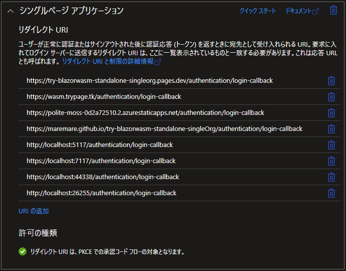
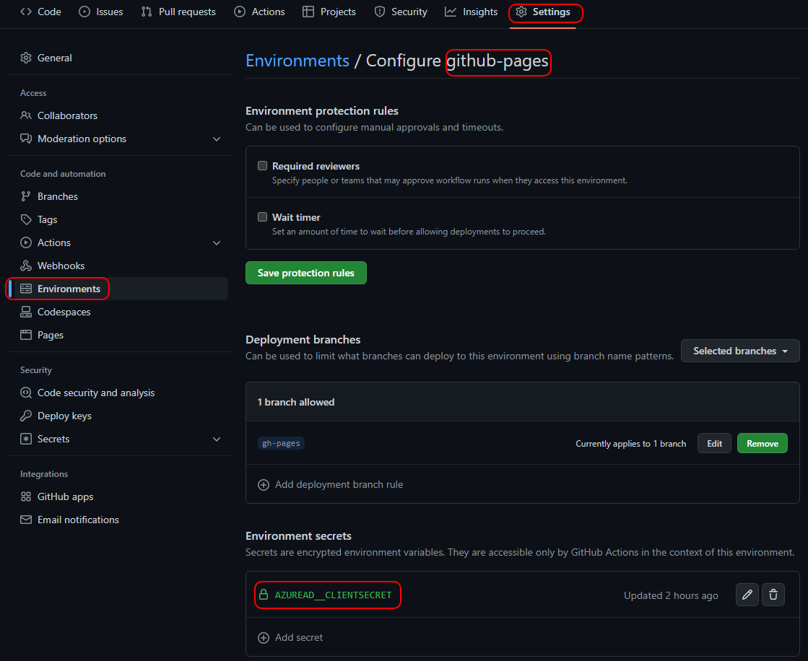
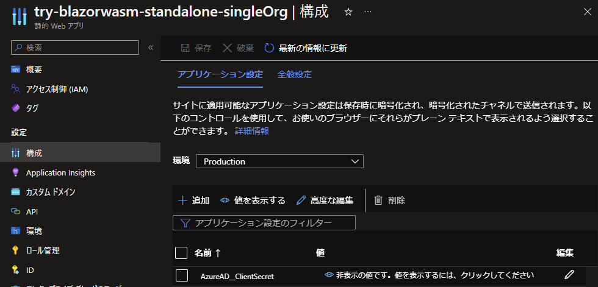
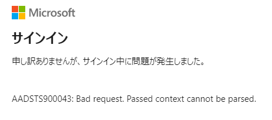
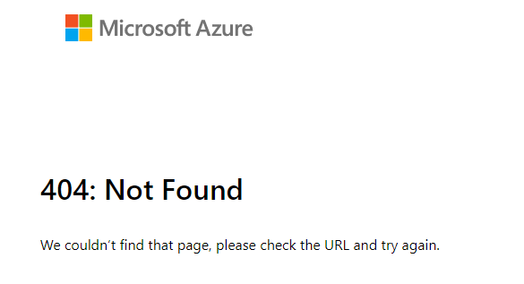
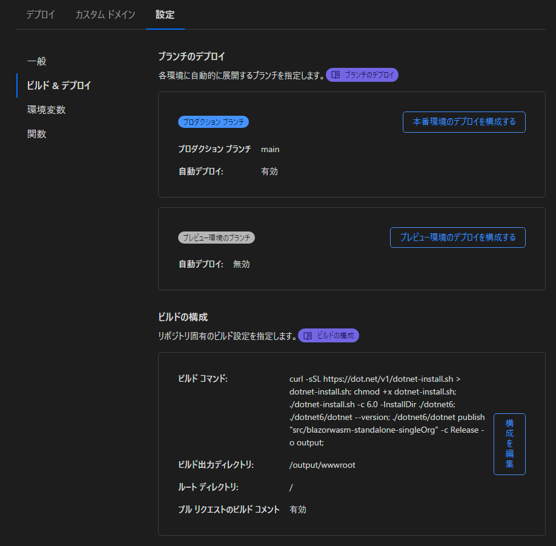

# try-blazorwasm-standalone-singleOrg

| Status | Site URL |
|--|--|
| [](https://github.com/MareMare/try-blazorwasm-standalone-singleOrg/actions/workflows/cd-ghpages.yml) | https://maremare.github.io/try-blazorwasm-standalone-singleOrg <br> https://wasm.trypage.tk |
| [](https://github.com/MareMare/try-blazorwasm-standalone-singleOrg/actions/workflows/azure-static-web-apps-polite-moss-0d2a72510.yml) | https://polite-moss-0d2a72510.2.azurestaticapps.net |
|  | https://try-blazorwasm-standalone-singleorg.pages.dev <br> https://wasm3.trypage.tk |

## 'Cannot read properties of undefined (reading 'toLowerCase')'

GitHub Pages あるいは Azure Static Web Apps へ発行し、実際にサイトへアクセスすると次のエラーが表示される。
```
There was an error trying to log you in: 'Cannot read properties of undefined (reading 'toLowerCase')'
```

対処方法は *.csproj に以下を追加すれば良いらしい。
```xml
<ItemGroup>
  <TrimmerRootAssembly Include="Microsoft.Authentication.WebAssembly.Msal" />
</ItemGroup>
```

詳細は https://github.com/dotnet/aspnetcore/issues/38082#issuecomment-1072762015 。

## リダイレクトの設定


## クライアントシークレットの設定
ユーザシークレットには以下のキーでクライアントシークレットを設定しているので、発行先の環境変数へ追加する必要がある。
```json
{
  "AzureAD:ClientSecret": "<<Client Secret>>"
}
```
### GitHub Pages


### Azure Static Web Apps




[Azure AD 認証と承認のエラー コード \- Microsoft Entra \| Microsoft Learn](https://learn.microsoft.com/ja-jp/azure/active-directory/develop/reference-aadsts-error-codes)

* AADSTS90043	
    > NationalCloudAuthCodeRedirection - 機能が無効になっています。


もしかして無料のホスティングプランだと設定できない？



以下が参考になりそう…

1. [Azure Static Web Apps の認証と承認 \| Microsoft Learn](https://learn.microsoft.com/ja-jp/azure/static-web-apps/authentication-authorization?tabs=invitations) （マネージド認証）
    > 1 構成済みの Azure Active Directory プロバイダーは、Microsoft アカウントでサインインを許可します。
    > 
    > 特定の Active Directory テナントにログインを制限するには、[カスタム Azure Active Directory プロバイダー] を構成します。
2. [Azure Static Web Apps でのカスタム認証 \| Microsoft Learn](https://learn.microsoft.com/ja-jp/azure/static-web-apps/authentication-custom?tabs=aad) （カスタム認証）
    > カスタム認証は、Azure Static Web Apps Standard プランでのみ使用できます。
3. [Azure Static Web AppsのアプリにAzure ADカスタム認証機能を追加](https://itc-engineering-blog.netlify.app/blogs/azure-static-web-apps-auth)
    > ## マネージド認証
    > > Azure AD のどのテナントでもログインできてしまいます。
    
    やりたいことは「カスタム認証」が適している。が、しかし無料が良かった…
    ここで断念。

### Cloudflare Pages
[Deploy a Blazor Site · Cloudflare Pages docs](https://developers.cloudflare.com/pages/framework-guides/deploy-a-blazor-site/#creating-the-build-script)



* ビルドの構成
  * ビルドコマンド
    ```sh
    curl -sSL https://dot.net/v1/dotnet-install.sh > dotnet-install.sh;
    chmod +x dotnet-install.sh;
    ./dotnet-install.sh -c 7.0 -InstallDir ./dotnet7;
    ./dotnet7/dotnet --version;
    ./dotnet7/dotnet publish "src/blazorwasm-standalone-singleOrg" -c Release -o output;
    ```
  * ビルド出力ディレクトリ
    ```sh
    /output/wwwroot
    ```
